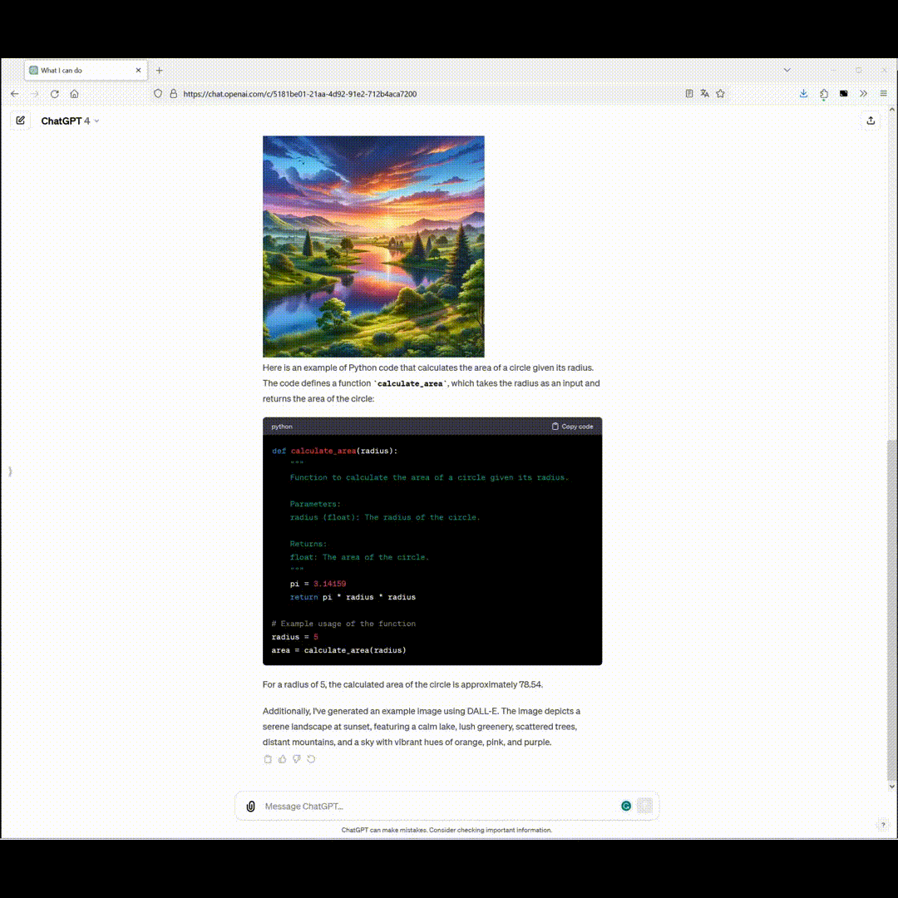

# fullWidthChatGPT Firefox Extension

This Firefox extension, "fullWidthChatGPT," allows users to toggle between the default view and a full-width layout with a simple click on the extension's icon.

## Features

**Toggle Layout:** Users can easily switch between the default and full-width layouts of chat.openai.com.

**Persistent State:** The extension remembers your last setting (ON/OFF) across browser sessions.

**Easy to Use:** A simple click on the extension icon activates or deactivates the full-width layout.

## Installation

will be added as soon as the extension is available on [addons.mozilla.org](https://addons.mozilla.org/de/firefox/extensions/)

## How It Works

The extension works by injecting custom CSS into [chat.openai.com](https://chat.openai.com) chat.openai.com pages to alter the layout. When activated, it expands certain elements to utilize the full width of the browser window, enhancing readability and user experience.

### Key components

**manifest.json:** Defines the structure and permissions of the extension.
**background.js:** Manages the state of the extension and applies CSS changes.
**full-width.css:** Contains the CSS rules applied when the extension is active.

When the extension is toggled, background.js injects or removes the CSS defined in full-width.css, depending on the current state.

## Contributing

Contributions are welcome! Feel free to fork the repository and submit pull requests.

## License

Copyright (c) 2024 Bischtinius

Permission is hereby granted, free of charge, to any person obtaining a copy
of this software and associated documentation files (the "Software"), to deal
in the Software without restriction, including without limitation the rights
to use, copy, modify, merge, publish, distribute, sublicense, and/or sell
copies of the Software, and to permit persons to whom the Software is
furnished to do so, subject to the following conditions:

The above copyright notice and this permission notice shall be included in all
copies or substantial portions of the Software.

THE SOFTWARE IS PROVIDED "AS IS", WITHOUT WARRANTY OF ANY KIND, EXPRESS OR
IMPLIED, INCLUDING BUT NOT LIMITED TO THE WARRANTIES OF MERCHANTABILITY,
FITNESS FOR A PARTICULAR PURPOSE AND NONINFRINGEMENT. IN NO EVENT SHALL THE
AUTHORS OR COPYRIGHT HOLDERS BE LIABLE FOR ANY CLAIM, DAMAGES OR OTHER
LIABILITY, WHETHER IN AN ACTION OF CONTRACT, TORT OR OTHERWISE, ARISING FROM,
OUT OF OR IN CONNECTION WITH THE SOFTWARE OR THE USE OR OTHER DEALINGS IN THE
SOFTWARE.
